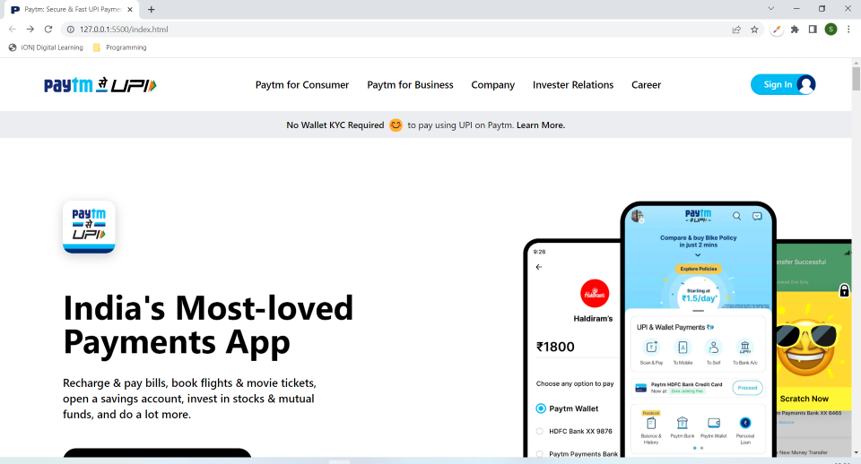
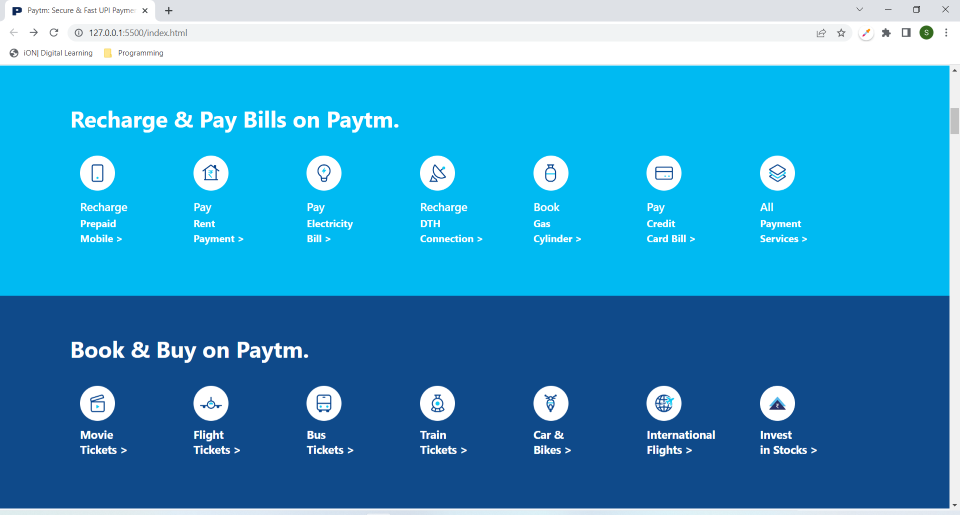
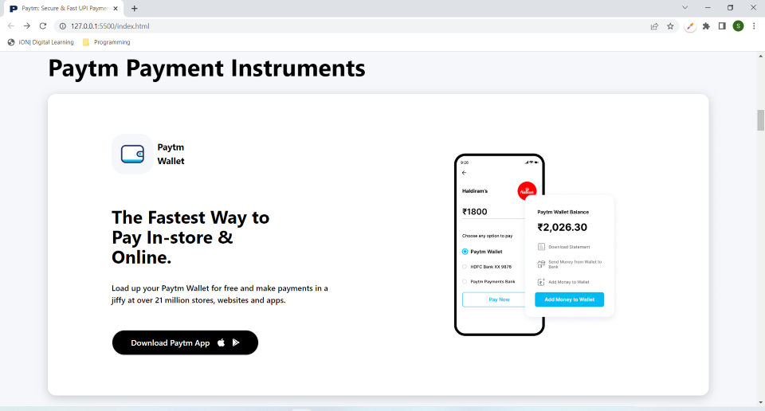
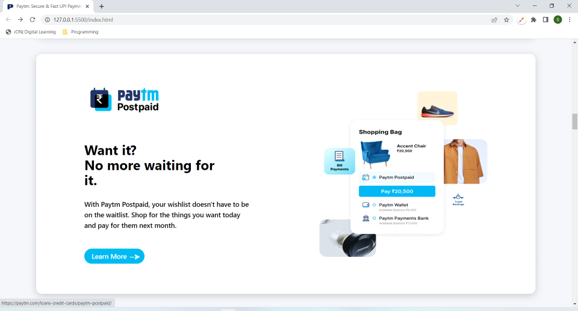
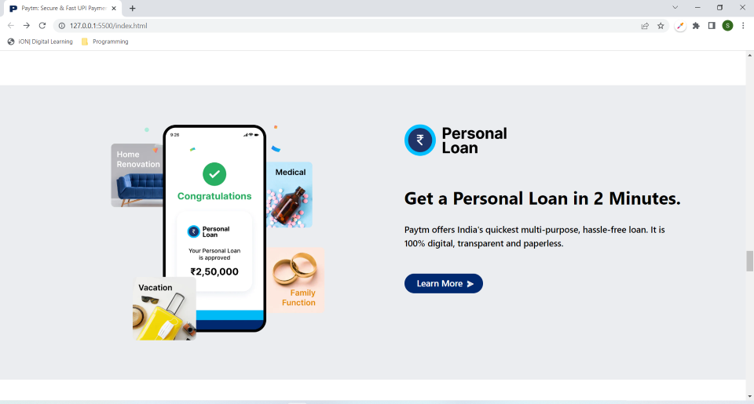
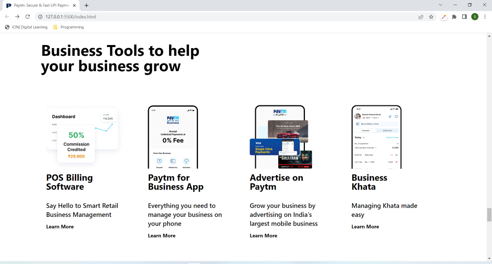
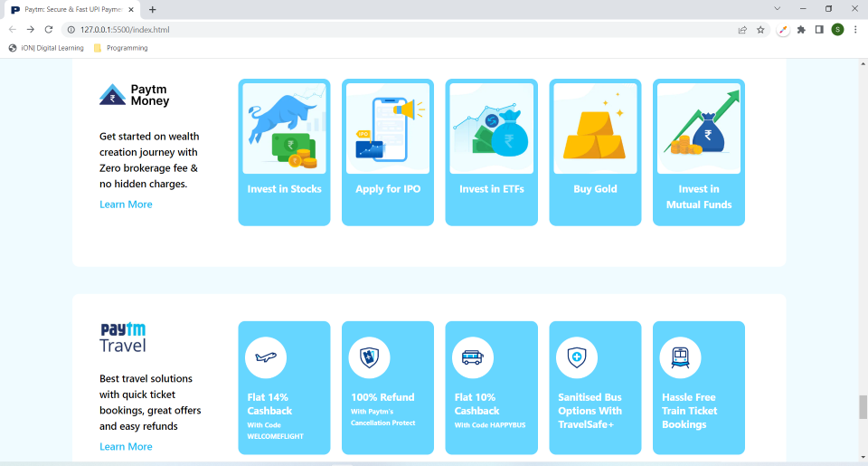
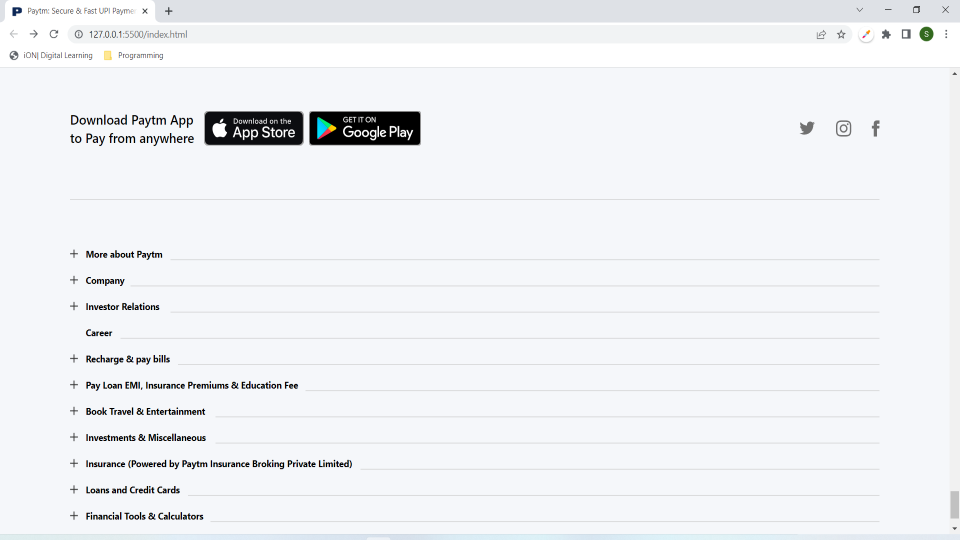

# Project-16 - Paytm Web App's-Landing-Page

## Description:

> A humble attempt to replicate the Paytm's Landing Page using only Tailwind CSS as well as making it fully responsive for devices of all screen sizes.

# 

**Landing-Page-Images:**

#

## What I have learnt while making this project?

> Since this was my first project ever where I have use Tailwind CSS, so it was really challenging, took a lot of time, going through documentation, learning so many minute details, for example learning about group and group-hover. But finally I have completed it. Now on to next one :D 

#

## Time taken to complete this project:
> Around 18 hrs, spread over the last three days, were spent in developing this fully-reponsive Landing Page of Paytm.

#

## Please see this project in action at below link:

**[Click to redirect to Project-16-Paytm](https://p16-paytm.netlify.app/)**

#

## Developed by:

**Sidharth Pandey**

**[Contact Me](mailto:sidp0008@gmail.com)**

#